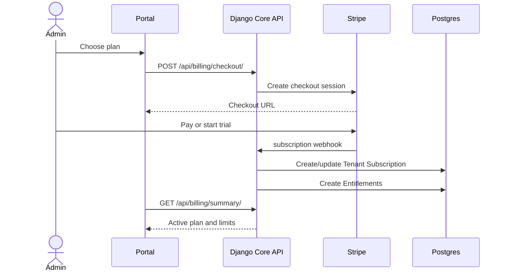
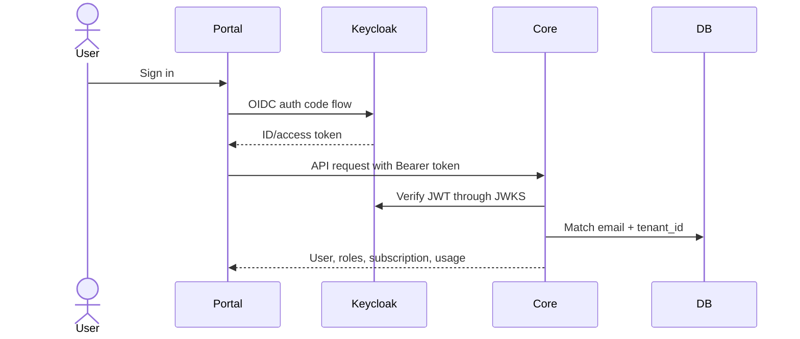
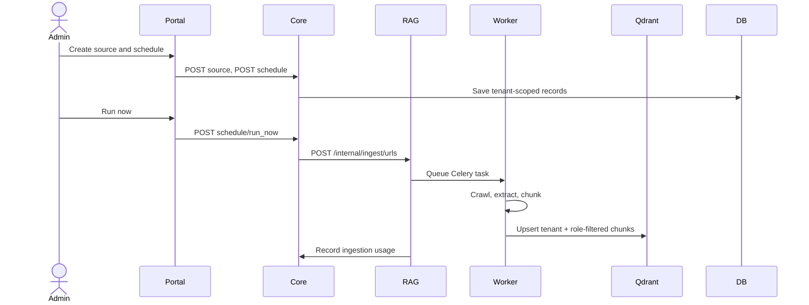
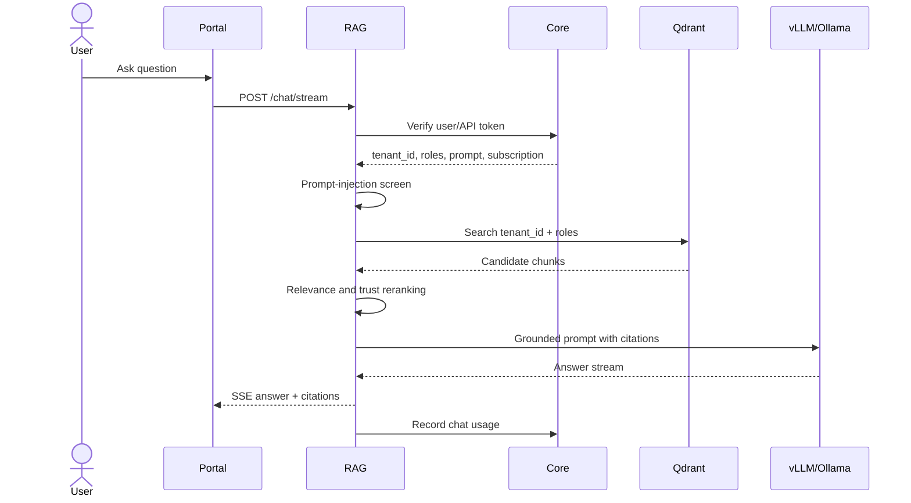
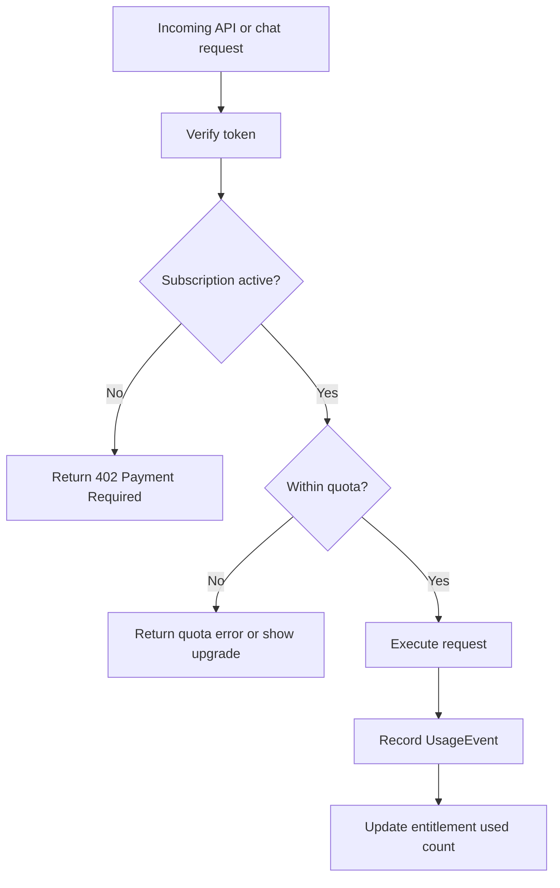

# Workflows

## Signup, Billing, and Tenant Provisioning

```mermaid
sequenceDiagram
    actor Admin
    participant Portal
    participant Core as Django Core API
    participant Stripe
    participant DB as Postgres
    Admin->>Portal: Choose plan
    Portal->>Core: POST /api/billing/checkout/
    Core->>Stripe: Create checkout session
    Stripe-->>Portal: Checkout URL
    Admin->>Stripe: Pay or start trial
    Stripe->>Core: subscription webhook
    Core->>DB: Create/update Tenant Subscription
    Core->>DB: Create Entitlements
    Portal->>Core: GET /api/billing/summary/
    Core-->>Portal: Active plan and limits
```

## Login and Tenant Resolution

```mermaid
sequenceDiagram
    actor User
    participant Portal
    participant Keycloak
    participant Core
    participant DB
    User->>Portal: Sign in
    Portal->>Keycloak: OIDC auth code flow
    Keycloak-->>Portal: ID/access token
    Portal->>Core: API request with Bearer token
    Core->>Keycloak: Verify JWT through JWKS
    Core->>DB: Match email + tenant_id
    Core-->>Portal: User, roles, subscription, usage
```

## Source Ingestion

```mermaid
sequenceDiagram
    actor Admin
    participant Portal
    participant Core
    participant RAG
    participant Worker
    participant Qdrant
    Admin->>Portal: Create source and schedule
    Portal->>Core: POST source, POST schedule
    Core->>DB: Save tenant-scoped records
    Admin->>Portal: Run now
    Portal->>Core: POST schedule/run_now
    Core->>RAG: POST /internal/ingest/urls
    RAG->>Worker: Queue Celery task
    Worker->>Worker: Crawl, extract, chunk
    Worker->>Qdrant: Upsert tenant + role-filtered chunks
    RAG->>Core: Record ingestion usage
```

## Chat Retrieval

```mermaid
sequenceDiagram
    actor User
    participant Portal
    participant RAG
    participant Core
    participant Qdrant
    participant LLM as vLLM/Ollama
    User->>Portal: Ask question
    Portal->>RAG: POST /chat/stream
    RAG->>Core: Verify user/API token
    Core-->>RAG: tenant_id, roles, prompt, subscription
    RAG->>RAG: Prompt-injection screen
    RAG->>Qdrant: Search tenant_id + roles
    Qdrant-->>RAG: Candidate chunks
    RAG->>RAG: Relevance and trust reranking
    RAG->>LLM: Grounded prompt with citations
    LLM-->>RAG: Answer stream
    RAG-->>Portal: SSE answer + citations
    RAG->>Core: Record chat usage
```

## Subscription Enforcement

```mermaid
flowchart TD
    Request[Incoming API or chat request] --> Verify[Verify token]
    Verify --> Sub{Subscription active?}
    Sub -- No --> Block[Return 402 Payment Required]
    Sub -- Yes --> Ent{Within quota?}
    Ent -- No --> Limit[Return quota error or show upgrade]
    Ent -- Yes --> Work[Execute request]
    Work --> Usage[Record UsageEvent]
    Usage --> EntUpdate[Update entitlement used count]
```
